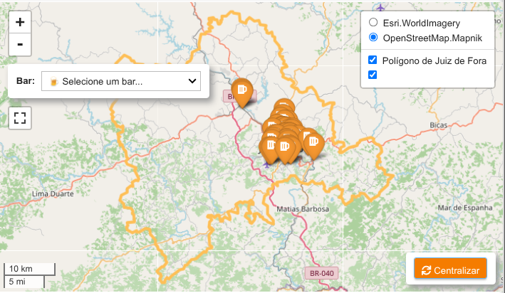

# Comida di Buteco 2026 Juiz de Fora

### Introdução

O historiador, turismólogo e professor [Inácio Botto](https://www.instagram.com/inaciobotto) criou um mapa informativo no *Google My Map*, para o usuário descobrir os bares participantes do *Comida di Buteco 2026 Juiz de Fora*, conhecer os petiscos criados especialmente para o concurso, explorar os endereços e montar seu roteiro.

Já descrevemos [aqui](https://github.com/guiajf/riscojf) como baixar o arquivo *.kml* gerado pela ferramenta do Google, que contém os dados geográficos indispensáveis para reprodução do mapa em outro ambiente.


### Objetivo

Este projeto visa reconstruir o mapa dos bares participantes do concurso "Comida di Buteco 2026 Juiz de Fora", no *Jupyter Lab*, usando bibliotecas do **Python**.

### Importamos as bibliotecas


```python
import geopandas as gpd
import pandas as pd
import numpy as np
import fiona
import geobr

import requests
from bs4 import BeautifulSoup
from pathlib import Path

import os
import re
import time

import unicodedata
import json
from ipyleaflet import (
    Map, TileLayer, GeoJSON, Marker, Popup, 
    LayersControl, FullScreenControl, WidgetControl,
    AwesomeIcon, Circle, basemaps, ScaleControl, basemap_to_tiles
)

from ipywidgets import HTML, widgets,interact,AppLayout,Layout, VBox, HBox
import ipywidgets as widgets
from IPython.display import display

from shapely.geometry import Point
import warnings
warnings.filterwarnings('ignore')

```

### Baixamos os dados

Baixamos o arquivo *.kml*, que contém as coordenadas.


```python
coordenadas = fiona.listlayers("bares_jf.kml")
```

### Criamos o GeoDataFrame

Criamos o *GeoDataFrame*, que contém as coordenadas dos bares.


```python
gdfs = []
for layer in coordenadas:
    gdf = gpd.read_file("bares_jf.kml", layer=layer)
    # Adicionar coluna identificando a camada de origem
    gdf['camada_origem'] = layer
    gdfs.append(gdf)

# Combinar todos os GeoDataFrames
gdf = pd.concat(gdfs, ignore_index=True)
```

### Inspecionamos o GeoDataFrame


```python
gdf[:5]
```


<div>
<style scoped>
    .dataframe tbody tr th:only-of-type {
        vertical-align: middle;
    }

    .dataframe tbody tr th {
        vertical-align: top;
    }

    .dataframe thead th {
        text-align: right;
    }
</style>
<table border="1" class="dataframe">
  <thead>
    <tr style="text-align: right;">
      <th></th>
      <th>Name</th>
      <th>Description</th>
      <th>geometry</th>
      <th>camada_origem</th>
    </tr>
  </thead>
  <tbody>
    <tr>
      <th>0</th>
      <td>Adega Bar</td>
      <td></td>
      <td>POINT Z (-43.29897 -21.782 0)</td>
      <td>Mapa com os 40 bares participantes do Comida d...</td>
    </tr>
    <tr>
      <th>1</th>
      <td>Bar Dias</td>
      <td></td>
      <td>POINT Z (-43.361 -21.7366 0)</td>
      <td>Mapa com os 40 bares participantes do Comida d...</td>
    </tr>
    <tr>
      <th>2</th>
      <td>Bar do Abílio</td>
      <td></td>
      <td>POINT Z (-43.34722 -21.75861 0)</td>
      <td>Mapa com os 40 bares participantes do Comida d...</td>
    </tr>
    <tr>
      <th>3</th>
      <td>Bar do Antonio</td>
      <td></td>
      <td>POINT Z (-43.37231 -21.76657 0)</td>
      <td>Mapa com os 40 bares participantes do Comida d...</td>
    </tr>
    <tr>
      <th>4</th>
      <td>Bar do Bené</td>
      <td></td>
      <td>POINT Z (-43.37849 -21.77562 0)</td>
      <td>Mapa com os 40 bares participantes do Comida d...</td>
    </tr>
  </tbody>
</table>
</div>


```python
gdf.info()
```

    <class 'geopandas.geodataframe.GeoDataFrame'>
    RangeIndex: 40 entries, 0 to 39
    Data columns (total 4 columns):
     #   Column         Non-Null Count  Dtype   
    ---  ------         --------------  -----   
     0   Name           40 non-null     object  
     1   Description    40 non-null     object  
     2   geometry       40 non-null     geometry
     3   camada_origem  40 non-null     object  
    dtypes: geometry(1), object(3)
    memory usage: 1.4+ KB


### Extraímos os endereços dos butecos participantes

Definimos uma função para extrair os endereços dos butecos participanes na página oficial do concurso:
https://zinecultural.com/blog/comida-di-buteco-juiz-de-fora.


```python
import requests
from bs4 import BeautifulSoup
import pandas as pd
import re
import time
import os
from pathlib import Path

def limpar_endereco(endereco):
    """
    Remove o município do endereço
    """
    if not endereco:
        return endereco
    
    # Remove ", Juiz de Fora" (com ou sem espaços)
    endereco_limpo = re.sub(r',\s*Juiz de Fora(\s*-\s*MG)?', '', endereco)
    
    # Remove também variações como " - Juiz de Fora"
    endereco_limpo = re.sub(r'\s*[-–]\s*Juiz de Fora(\s*-\s*MG)?', '', endereco_limpo)
    
    # Remove espaços extras no final
    endereco_limpo = endereco_limpo.strip()
    
    return endereco_limpo

def extrair_campo(texto, padroes):
    """
    Extrai um campo usando múltiplos padrões de regex
    """
    for padrao in padroes:
        match = re.search(padrao, texto, re.DOTALL | re.IGNORECASE)
        if match:
            return match.group(1).strip()
    return ''

def extrair_butecos_completo(url):
    """
    Extrai dados completos dos participantes do Comida di Buteco
    Retorna: DataFrame com nome, endereço, petisco, contato, instagram
    """
    headers = {
        'User-Agent': 'Mozilla/5.0 (Windows NT 10.0; Win64; x64) AppleWebKit/537.36 (KHTML, like Gecko) Chrome/120.0.0.0 Safari/537.36',
        'Accept': 'text/html,application/xhtml+xml,application/xml;q=0.9,image/webp,*/*;q=0.8',
        'Accept-Language': 'pt-BR,pt;q=0.9,en;q=0.8',
    }
    
    try:
        response = requests.get(url, timeout=15, headers=headers)
        response.raise_for_status()
    except Exception as e:
        print(f"Erro ao acessar: {e}")
        return pd.DataFrame()
    
    soup = BeautifulSoup(response.content, 'html.parser')
    
    # Localiza a seção específica dos participantes
    secao_butecos = None
    for h2 in soup.find_all('h2'):
        if 'Participantes Comida di Buteco 2026' in h2.get_text():
            secao_butecos = h2
            break
    
    if not secao_butecos:
        print("Seção 'Participantes Comida di Buteco 2026' não encontrada!")
        return pd.DataFrame()
    
    # Lista para armazenar os dados
    dados_butecos = []
    
    # Encontra todos os h3 dentro da seção dos butecos
    current = secao_butecos.find_next_sibling()
    butecos_encontrados = 0
    
    while current:
        # Procura por h3 que contenham padrão de buteco (número de 1 a 40)
        if current.name == 'h3':
            texto_h3 = current.get_text(strip=True)
            # Verifica se é um buteco (contém padrão como "01 de 40" ou "02 de 40")
            if re.search(r'\d+\s*de\s*40', texto_h3):
                # Extrai nome do buteco
                nome = texto_h3
                # Remove o número inicial (ex: "01 de 40 – ")
                nome = re.sub(r'^\d+\s*de\s*40\s*[–-]\s*', '', nome)
                # Remove espaços extras e caracteres especiais
                nome = nome.replace(' ', ' ').strip()
                
                # Inicializa campos
                petisco = ''
                descricao = ''
                endereco = ''
                contato = ''
                instagram = ''
                funcionamento = ''
                
                # Percorre os elementos irmãos até o próximo h3
                next_elem = current.find_next_sibling()
                while next_elem and next_elem.name != 'h3':
                    # Obtém o texto completo do elemento
                    texto_completo = next_elem.get_text(' ', strip=True)
                    
                    # Tenta extrair cada campo usando múltiplos padrões
                    
                    # Extrai petisco
                    if not petisco:
                        petisco = extrair_campo(texto_completo, [
                            r'(?:🥘\s*)?Petisco:\s*(.+?)(?=(?:🥣|Descrição|🏡|Endereço|☎|Contato|📱|Instagram|⏰|Funcionamento|$))',
                            r'(?:🥘\s*)?Petisco\s*:\s*(.+?)(?=(?:🥣|Descrição|🏡|Endereço|☎|Contato|📱|Instagram|⏰|Funcionamento|$))'
                        ])
                    
                    # Extrai descrição
                    if not descricao:
                        descricao = extrair_campo(texto_completo, [
                            r'(?:🥣\s*)?Descrição do petisco:\s*(.+?)(?=(?:🏡|Endereço|☎|Contato|📱|Instagram|⏰|Funcionamento|$))',
                            r'(?:🥣\s*)?Descrição\s*:\s*(.+?)(?=(?:🏡|Endereço|☎|Contato|📱|Instagram|⏰|Funcionamento|$))'
                        ])
                    
                    # Extrai endereço - versão corrigida para lidar com variações
                    if not endereco:
                        endereco = extrair_campo(texto_completo, [
                            # Padrão 1: <strong>🏡 Endereço:</strong> texto
                            r'(?:🏡\s*)?<strong>Endereço:</strong>\s*(.+?)(?=(?:☎|Contato|📱|Instagram|⏰|Funcionamento|$))',
                            # Padrão 2: 🏡 <strong>Endereço</strong>: texto (caso do Bar do Bené)
                            r'🏡\s*<strong>Endereço</strong>:\s*(.+?)(?=(?:☎|Contato|📱|Instagram|⏰|Funcionamento|$))',
                            # Padrão 3: <strong>🏡 Endereço:</strong> texto (sem espaço)
                            r'<strong>🏡\s*Endereço:</strong>\s*(.+?)(?=(?:☎|Contato|📱|Instagram|⏰|Funcionamento|$))',
                            # Padrão 4: 🏡 Endereço: texto
                            r'🏡\s*Endereço\s*:\s*(.+?)(?=(?:☎|Contato|📱|Instagram|⏰|Funcionamento|$))',
                            # Padrão 5: Endereço: texto (fallback)
                            r'Endereço\s*:\s*(.+?)(?=(?:☎|Contato|📱|Instagram|⏰|Funcionamento|$))'
                        ])
                        
                        # Se encontrou endereço, limpa o texto
                        if endereco:
                            # Remove tags HTML residuais
                            endereco = re.sub(r'<[^>]+>', '', endereco)
                            # Remove emojis que possam ter ficado
                            endereco = re.sub(r'[🏡]', '', endereco)
                            endereco = endereco.strip()
                            # Limpa o município
                            endereco = limpar_endereco(endereco)
                    
                    # Extrai contato
                    if not contato:
                        contato = extrair_campo(texto_completo, [
                            r'(?:☎\s*)?Contato:\s*(.+?)(?=(?:📱|Instagram|⏰|Funcionamento|$))',
                            r'(?:☎\s*)?Contato\s*:\s*(.+?)(?=(?:📱|Instagram|⏰|Funcionamento|$))'
                        ])
                    
                    # Extrai Instagram
                    if not instagram:
                        instagram = extrair_campo(texto_completo, [
                            r'(?:📱\s*)?Instagram:\s*@?([^\s]+)',
                            r'(?:📱\s*)?Instagram\s*:\s*@?([^\s]+)'
                        ])
                        
                        # Se não encontrou com regex, tenta buscar link
                        if not instagram:
                            link_insta = next_elem.find('a', href=re.compile(r'instagram\.com'))
                            if link_insta:
                                instagram = link_insta.get_text(strip=True).replace('@', '').strip()
                    
                    # Extrai funcionamento
                    if not funcionamento:
                        funcionamento = extrair_campo(texto_completo, [
                            r'(?:⏰\s*)?Funcionamento:\s*(.+)',
                            r'(?:⏰\s*)?Funcionamento\s*:\s*(.+)'
                        ])
                    
                    # Avança para o próximo elemento
                    next_elem = next_elem.find_next_sibling()
                
                # Se ainda não encontrou endereço, tenta buscar diretamente nos elementos
                if not endereco:
                    # Procura qualquer elemento que contenha "Endereço" no texto
                    for elem in current.find_all_next():
                        if elem.name == 'p' and ('Endereço' in elem.get_text() or '🏡' in elem.get_text()):
                            texto_end = elem.get_text(' ', strip=True)
                            # Tenta extrair o endereço
                            end_match = re.search(r'Endereço\s*:?\s*(.+?)(?=(?:☎|Contato|📱|Instagram|$))', texto_end, re.IGNORECASE)
                            if end_match:
                                endereco = end_match.group(1).strip()
                                # Remove emojis e tags
                                endereco = re.sub(r'[🏡]', '', endereco)
                                endereco = limpar_endereco(endereco)
                                break
                
                # Adiciona aos dados
                dados_butecos.append({
                    'Name': nome,
                    'Endereço': endereco,
                    'Petisco': petisco,
                    'Contato': contato,
                    'Instagram': instagram,
                    'Descrição': descricao,
                    'Funcionamento': funcionamento
                })
                
                butecos_encontrados += 1
        
        # Avança para o próximo elemento
        current = current.find_next_sibling()
        
        # Para quando encontrar a próxima seção (h2) que não seja de butecos
        if current and current.name == 'h2':
            break
    
    return pd.DataFrame(dados_butecos)

def salvar_csv_com_backup(df, nome_arquivo):
    """
    Salva CSV com criação de backup se arquivo já existir
    """
    if os.path.exists(nome_arquivo):
        timestamp = time.strftime("%Y%m%d_%H%M%S")
        nome_backup = f"{Path(nome_arquivo).stem}_backup_{timestamp}{Path(nome_arquivo).suffix}"
        
        try:
            os.rename(nome_arquivo, nome_backup)
            print(f"Backup criado: {nome_backup}")
        except Exception as e:
            print(f"Não foi possível criar backup: {e}")
    
    df.to_csv(nome_arquivo, index=False, encoding='utf-8-sig')
    print(f"Arquivo salvo: {nome_arquivo}")

# ========== CONFIGURAÇÕES ==========
URL = "https://zinecultural.com/blog/comida-di-buteco-juiz-de-fora"
NOME_ARQUIVO = "butecos_comida_2026.csv"

# ========== EXECUÇÃO PRINCIPAL ==========
# Realiza o scraping sempre que o script é executado
df_butecos = extrair_butecos_completo(URL)

if len(df_butecos) > 0:
    # Salva com backup (se arquivo existir, cria backup antes)
    salvar_csv_com_backup(df_butecos, NOME_ARQUIVO)
else:
    print("Nenhum dado foi extraído.")
```

    Backup criado: butecos_comida_2026_backup_20260406_160522.csv
    Arquivo salvo: butecos_comida_2026.csv


```python
enderecos = pd.read_csv("butecos_comida_2026.csv")
enderecos.info()
```

    <class 'pandas.core.frame.DataFrame'>
    RangeIndex: 40 entries, 0 to 39
    Data columns (total 7 columns):
     #   Column         Non-Null Count  Dtype 
    ---  ------         --------------  ----- 
     0   Name           40 non-null     object
     1   Endereço       40 non-null     object
     2   Petisco        40 non-null     object
     3   Contato        40 non-null     object
     4   Instagram      40 non-null     object
     5   Descrição      40 non-null     object
     6   Funcionamento  40 non-null     object
    dtypes: object(7)
    memory usage: 2.3+ KB


### Mesclamos os dois dataframes


```python
gdf_com_endereco = gdf.merge(enderecos, on='Name', how='left')
gdf_com_endereco.info()
```

    <class 'geopandas.geodataframe.GeoDataFrame'>
    RangeIndex: 40 entries, 0 to 39
    Data columns (total 10 columns):
     #   Column         Non-Null Count  Dtype   
    ---  ------         --------------  -----   
     0   Name           40 non-null     object  
     1   Description    40 non-null     object  
     2   geometry       40 non-null     geometry
     3   camada_origem  40 non-null     object  
     4   Endereço       26 non-null     object  
     5   Petisco        26 non-null     object  
     6   Contato        26 non-null     object  
     7   Instagram      26 non-null     object  
     8   Descrição      26 non-null     object  
     9   Funcionamento  26 non-null     object  
    dtypes: geometry(1), object(9)
    memory usage: 3.3+ KB


### Processamos e limpamos os endereços

**Definimos as funções auxiliares**


```python
def normalizar_texto(texto):
    """Remove acentos e converte para maiúsculas para comparação"""
    if pd.isna(texto):
        return texto
    # Converte para string, remove acentos e deixa em maiúsculo
    texto = str(texto)
    texto = unicodedata.normalize('NFKD', texto).encode('ASCII', 'ignore').decode('ASCII')
    return texto.strip().upper()

def limpar_nome_buteco(nome):
    """Remove sufixos como ' - Juíz de Fora' e outros padrões indesejados"""
    if pd.isna(nome):
        return nome
    
    nome = str(nome)
    
    # Remover padrões específicos
    padroes_remover = [
        ' - Juíz de Fora',
        ' - Bar e Restaurante Alto dos Passos',
        ' Endereço:',
    ]
    
    for padrao in padroes_remover:
        nome = nome.replace(padrao, '')
    
    # Limpar espaços extras
    nome = nome.strip()
    
    return nome

```

**Verificamos os dados divergentes**


```python
# Lista de nomes no GeoDataFrame
nomes_gdf = set(gdf_com_endereco['Name'].tolist())
nomes_enderecos = set(enderecos['Name'].tolist())

print(f"Total no GeoDataFrame: {len(nomes_gdf)}")
print(f"Total no DataFrame endereços: {len(nomes_enderecos)}")

# Encontrar nomes que estão em um mas não no outro
apenas_gdf = nomes_gdf - nomes_enderecos
apenas_enderecos = nomes_enderecos - nomes_gdf

if apenas_gdf:
    print(f"\nNomes no GDF mas NÃO no DataFrame endereços ({len(apenas_gdf)}):")
    for nome in sorted(apenas_gdf)[:15]:
        print(f"  - '{nome}'")
        
if apenas_enderecos:
    print(f"\nNomes no DataFrame endereços mas NÃO no GDF ({len(apenas_enderecos)}):")
    for nome in sorted(apenas_enderecos)[:15]:
        print(f"  - '{nome}'")
```

    Total no GeoDataFrame: 40
    Total no DataFrame endereços: 40
    
    Nomes no GDF mas NÃO no DataFrame endereços (14):
      - 'Bar Batata D'Mola'
      - 'Bar Du Buneco - Juíz de Fora'
      - 'Bar Torresmo'
      - 'Bar do Antonio'
      - 'Birosca Bar e Restaurante'
      - 'Carlota'
      - 'Coliseum Bar'
      - 'Compadre Grill Costelaria'
      - 'Don Juan Gastronomia e eventos'
      - 'Espetinho Da Villa - Bar e Restaurante Alto dos Passos'
      - 'IBITIBAR'
      - 'Informal Bar & Restaurante'
      - 'Lero Lero'
      - 'Pão Moiado Bar'
    
    Nomes no DataFrame endereços mas NÃO no GDF (14):
      - 'Bar do Antônio'
      - 'Bar do Torresmo'
      - 'Bar du Buneco'
      - 'Batata d’ Mola'
      - 'Birosca'
      - 'Carlota Bar e Restaurante'
      - 'Coliseum Bar e Restaurante'
      - 'Costelaria Compadre Grill'
      - 'Don Juan Gastronomia'
      - 'Espetinho da Villa'
      - 'Ibitibar'
      - 'Informal Bar e Restaurante'
      - 'Lero Lero Bar'
      - 'Pão Moiado'


**Efetuamos o mapeamento manual**


```python
gdf_final = gdf_com_endereco.copy()

# Adicionar colunas auxiliares
gdf_final['Name_clean'] = gdf_final['Name'].apply(limpar_nome_buteco)
gdf_final['Name_norm'] = gdf_final['Name_clean'].apply(normalizar_texto)

# Preparar endereços limpos
enderecos_limpo = enderecos.copy()
enderecos_limpo['Name_clean'] = enderecos_limpo['Name'].apply(limpar_nome_buteco)
enderecos_limpo['Name_norm'] = enderecos_limpo['Name_clean'].apply(normalizar_texto)

# Mapeamento baseado no diagnóstico (agora com nomes já padronizados)
mapeamento_nomes = {
    'Bar do Antonio': 'Bar do Antônio',
    'Bar Torresmo': 'Bar do Torresmo',
    'Bar Du Buneco': 'Bar Du Buneco - Juíz de Fora',
    'Bar Batata D\'Mola': 'Batata d’ Mola',
    'Birosca Bar e Restaurante': 'Birosca',
    'Lero Lero': 'Lero Lero Bar',
    'Pão Moiado Bar': 'Pão Moiado',
    'Ibitibar': 'IBITIBAR',
    'Carlota': 'Carlota Bar e Restaurante',
    'Coliseum Bar': 'Coliseum Bar e Restaurante',
    'Informal Bar & Restaurante': 'Informal Bar e Restaurante',
    'Compadre Grill Costelaria': 'Costelaria Compadre Grill',
    'Don Juan Gastronomia e eventos': 'Don Juan Gastronomia',
    'Espetinho da Villa': 'Espetinho Da Villa - Bar e Restaurante Alto dos Passos',
}

# Criar um dicionário para acesso rápido aos dados completos
# Chave: nome normalizado, Valor: registro completo
enderecos_dict = {}
for _, row in enderecos_limpo.iterrows():
    # Usar múltiplas chaves para facilitar matching
    enderecos_dict[row['Name_clean']] = row
    enderecos_dict[row['Name_norm']] = row

# Adicionar mapeamento manual ao dicionário
for nome_gdf, nome_endereco in mapeamento_nomes.items():
    nome_gdf_clean = limpar_nome_buteco(nome_gdf)
    if nome_gdf_clean not in enderecos_dict:
        nome_end_clean = limpar_nome_buteco(nome_endereco)
        if nome_end_clean in enderecos_dict:
            enderecos_dict[nome_gdf_clean] = enderecos_dict[nome_end_clean]

# Preencher todos os dados
for idx, row in gdf_final.iterrows():
    nome_clean = row['Name_clean']
    nome_norm = row['Name_norm']
    
    # Buscar no dicionário
    registro = None
    if nome_clean in enderecos_dict:
        registro = enderecos_dict[nome_clean]
    elif nome_norm in enderecos_dict:
        registro = enderecos_dict[nome_norm]
    
    # Se encontrou, preencher todas as colunas
    if registro is not None:
        gdf_final.at[idx, 'Endereço'] = registro['Endereço']
        gdf_final.at[idx, 'Petisco'] = registro['Petisco']
        gdf_final.at[idx, 'Contato'] = registro['Contato']
        gdf_final.at[idx, 'Instagram'] = registro['Instagram']
        gdf_final.at[idx, 'Descrição'] = registro['Descrição']
        gdf_final.at[idx, 'Funcionamento'] = registro['Funcionamento']

# Remover, renomear e reorganizar em uma sequência
gdf_final = (gdf_final
             .drop(columns=['Name', 'Name_clean'])
             .rename(columns={'Name_norm': 'Name'})
             .reindex(columns=['Name'] + [col for col in gdf_final.columns 
                                           if col not in ['Name', 'Name_clean', 'Name_norm']]))

# Verificar resultado
print(f"Total de registros: {len(gdf_final)}")
print(f"Registros com endereço preenchido: {gdf_final['Endereço'].notna().sum()}")
print(f"Taxa de sucesso: {gdf_final['Endereço'].notna().sum() / len(gdf_final) * 100:.1f}%")
```

    Total de registros: 40
    Registros com endereço preenchido: 40
    Taxa de sucesso: 100.0%


**Identificamos os butecos sem endereço**


```python
# Mostrar os registros que ainda ficaram sem endereço
sem_endereco = gdf_final[gdf_final['Endereço'].isna()]
if len(sem_endereco) > 0:
    print(f"\nAinda há {len(sem_endereco)} butecos sem endereço:")
    for idx, row in sem_endereco.iterrows():
        print(f"  - {row['Name']}")
    
    # Listar possíveis correspondências para os que faltam
   
    for idx, row in sem_endereco.iterrows():
        nome_gdf = row['Name']
        nome_gdf_norm = normalizar_texto(nome_gdf)
        print(f"\n'{nome_gdf}':")
        possiveis = []
        for _, end_row in enderecos.iterrows():
            nome_end = end_row['Name']
            nome_end_norm = normalizar_texto(nome_end)
            if (nome_gdf_norm in nome_end_norm or nome_end_norm in nome_gdf_norm or
                any(palavra in nome_gdf_norm for palavra in nome_end_norm.split() if len(palavra) > 3)):
                possiveis.append(nome_end)
        if possiveis:
            for p in possiveis[:3]:
                print(f" Possível: '{p}'")
        else:
            print("Nenhuma correspondência encontrada")
else:
    print("\n✅ Todos os 40 butecos receberam endereço com sucesso!")
```

    
    ✅ Todos os 40 butecos receberam endereço com sucesso!


### Definimos o polígono do município


```python
jf = geobr.read_municipality(code_muni=3136702, year=2022)
```

### Calculamos o centro do mapa


```python
gdf = gdf_final.copy()

# Verificação de segurança - garantir que os dados foram carregados
if jf is None or jf.empty:
    raise ValueError("Erro: Dados do município não carregados!")

jf_wgs84 = jf.to_crs(epsg=4326)
jf_bounds = jf_wgs84.total_bounds  # [minx, miny, maxx, maxy] = [lon_min, lat_min, lon_max, lat_max]

# Calcular centro corretamente
center_lat = (jf_bounds[1] + jf_bounds[3]) / 2  # média das latitudes
center_lon = (jf_bounds[0] + jf_bounds[2]) / 2  # média das longitudes

# Formato para fit_bounds: [[south, west], [north, east]]
map_bounds = [
    [jf_bounds[1], jf_bounds[0]],  # [lat_min, lon_min]
    [jf_bounds[3], jf_bounds[2]]   # [lat_max, lon_max]
]

# Calcular zoom apropriado baseado nos bounds
def calculate_zoom(bounds):
    """Calcula zoom nível apropriado baseado na extensão dos bounds"""
    lat_diff = bounds[3] - bounds[1]  # lat_max - lat_min
    lon_diff = bounds[2] - bounds[0]  # lon_max - lon_min
    max_diff = max(lat_diff, lon_diff)
    
    # Fórmula empírica para calcular zoom baseado na extensão
    if max_diff > 5:
        return 6
    elif max_diff > 2:
        return 7
    elif max_diff > 1:
        return 8
    elif max_diff > 0.5:
        return 9
    elif max_diff > 0.2:
        return 10
    elif max_diff > 0.1:
        return 11
    else:
        return 12


# Calcular zoom inicial baseado na extensão (sua função está boa, mantenha-a)
initial_zoom = calculate_zoom(jf_bounds)

# Debug - verifique no console se estes valores são aproximadamente:
# lon: -43.6 a -43.1, lat: -21.9 a -21.6 (Juiz de Fora)
print(f"Bounds: {jf_bounds}")
print(f"Center: {center_lat}, {center_lon}")


```

    Bounds: [-43.685934 -21.999147 -43.146653 -21.520559]
    Center: -21.759853, -43.416293499999995


### Definimos uma função para inicializar o mapa


```python
mapnik = basemap_to_tiles(basemaps.Esri.WorldImagery)
mapnik.base = True
toner = basemap_to_tiles(basemaps.OpenStreetMap.Mapnik)
toner.base = True

def initMap():
    # Criar mapa SEM usar fit_bounds na inicialização - apenas center e zoom
    m = Map(
        layers=[mapnik, toner],
        center=(float(center_lat), float(center_lon)),  # garantir que são floats
        zoom=int(initial_zoom -7),  # garantir que é int
        scroll_wheel_zoom=True,
        dragging=True,
        touch_zoom=True,
        double_click_zoom=True,
        box_zoom=True,
        keyboard=True,
        attribution_control=False
    )
    
    return m

m = initMap()

# Camada CartoDB Light
cartodb_light = TileLayer(
    url='https://{s}.basemaps.cartocdn.com/light_all/{z}/{x}/{y}.png',
    attribution='OpenStreetMap contributors & CARTO',
    subdomains='abcd'
)
#m.add_layer(cartodb_light)
```

### Adicionamos o polígono como uma camada json


```python
# Converter GeoJSON e adicionar polígono de Juiz de Fora
jf_geojson = jf.to_crs(epsg=4326)
jf_geojson_data = json.loads(jf_geojson.to_json())

# Estilo como dicionário (ipyleaflet não aceita função lambda no style)
geojson_style = {
    'fillColor': 'transparent',
    'color': '#FEBF57',
    'weight': 4,
    'fillOpacity': 0.3
}

geojson_layer = GeoJSON(
    data=jf_geojson_data,
    style=geojson_style,
    name='Polígono de Juiz de Fora'
)
# Tooltip via popup simples ao clicar (ipyleaflet não tem tooltip nativo no GeoJSON)
def handle_geojson_click(feature, **kwargs):
    if feature and feature.get('properties', {}).get('name_muni'):
        geojson_layer.popup = Popup(
            child=widgets.HTML(value=f"<b>{feature['properties']['name_muni']}</b>"),
            location=kwargs.get('coordinates', (center_lat, center_lon)),
            close_button=True,
            auto_close=True
        )
geojson_layer.on_click(handle_geojson_click)

m.add_layer(geojson_layer)

```

### Adicionamos marcadores personalizados


```python

beer_icon = AwesomeIcon(
    name='beer',
    marker_color='orange',
    icon_color='white',
    prefix='fa'
)

bars_data = {}
highlight_circles = {}

for idx, row in gdf.iterrows():
    if row['geometry'] is None:
        continue
        
    if row['geometry'].geom_type == 'Point':
        lon, lat = row['geometry'].x, row['geometry'].y
    elif row['geometry'].geom_type in ['Polygon', 'MultiPolygon']:
        centroid = row['geometry'].centroid
        lon, lat = centroid.x, centroid.y
    else:
        continue
    
    # Converter coordenadas dos marcadores também!
    lat = float(lat)
    lon = float(lon)
    
    nome = row['Name'] if row['Name'] else "Sem nome"
    endereco = row['Endereço'] if row['Endereço'] else "Endereço não disponível"
    
    bars_data[nome] = {'lat': lat, 'lon': lon, 'Endereço': endereco}
    
    popup_content = widgets.HTML(
        value=f"<b>{nome}</b><br><i>{endereco}</i>",
        layout=widgets.Layout(min_width='200px')
    )
    
    marker = Marker(
        location=(lat, lon),
        icon=beer_icon,
        title=nome,
        draggable=False
    )
    
    popup = Popup(child=popup_content, close_button=True, auto_close=True)
    marker.popup = popup
    m.add_layer(marker)

```

### Adicionamos controles


```python
valid_bars = sorted([nome for nome in bars_data.keys() if nome != "Sem nome"])

# Botão Reset
btn_reset = widgets.Button(
    description="Centralizar",
    button_style='warning',
    icon='refresh',
    tooltip='Voltar para visão geral do município',
    layout=widgets.Layout(width='auto', min_width='100px', padding='4px 8px')
)

def reset_map(b=None):
    # Limpar destaques
    for circle in list(highlight_circles.values()):
        m.remove_layer(circle)
    highlight_circles.clear()
    bar_dropdown.value = '🍺 Selecione um bar...'
    m.fit_bounds(map_bounds)

btn_reset.on_click(reset_map)

reset_container = widgets.HBox(
    [btn_reset],
    layout=widgets.Layout(
        background='white',
        padding='6px 10px',
        border_radius='4px',
        box_shadow='0 1px 5px rgba(0,0,0,0.4)'
    )
)

# Dropdown
bar_dropdown = widgets.Dropdown(
    options=['🍺 Selecione um bar...'] + valid_bars,
    value='🍺 Selecione um bar...',
    layout=widgets.Layout(width='220px')
)

def on_bar_selected(change):
    selected_bar = change['new']
    
    for circle in list(highlight_circles.values()):
        m.remove_layer(circle)
    highlight_circles.clear()
    
    if selected_bar and selected_bar != '🍺 Selecione um bar...' and selected_bar in bars_data:
        coords = bars_data[selected_bar]
        m.center = (coords['lat'], coords['lon'])
        m.zoom = 16
        
        highlight_circle = Circle(
            location=(coords['lat'], coords['lon']),
            radius=80,
            color='red',
            weight=3,
            fill=False,
            interactive=False
        )
        m.add_layer(highlight_circle)
        highlight_circles[selected_bar] = highlight_circle

bar_dropdown.observe(on_bar_selected, names='value')

dropdown_label = widgets.HTML(
    value='<b style="font-size:13px;margin-right:5px;">Bar:</b>',
    layout=widgets.Layout(display='inline-block')
)

dropdown_container = widgets.HBox(
    [dropdown_label, bar_dropdown],
    layout=widgets.Layout(
        align_items='center',
        background='white',
        padding='8px 10px',
        border_radius='4px',
        box_shadow='0 1px 5px rgba(0,0,0,0.4)',
        min_width='250px'
    )
)

# Adicionar controles
m.add_control(WidgetControl(widget=dropdown_container, position='topleft'))
m.add_control(WidgetControl(widget=reset_container, position='bottomright'))
m.add_control(ScaleControl(position='bottomleft'))
m.add_control(LayersControl(position='topright', collapsed=False))
m.add_control(FullScreenControl())

```

### Visualizamos o mapa


```python
display(m)
```



**Considerações finais:**

Reconstruimos o mapa dos bares participantes do concurso "Comida de Buteco 2026 Juiz de Fora*, a partir do arquivo *.kml*, com o auxílio de diversas bibliotecas do Python, para assegurar controle das características e seleção de texturas.

**Fontes:**

https://www.google.com/maps/d/u/0/viewer?hl=pt-BR&mid=1i8oEc2H5LTOLXi0Dw2YRpk2PbxjwvNQ&ll=-21.755007370709816%2C-43.370167478790286&z=16

